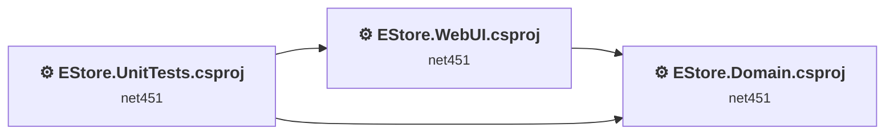
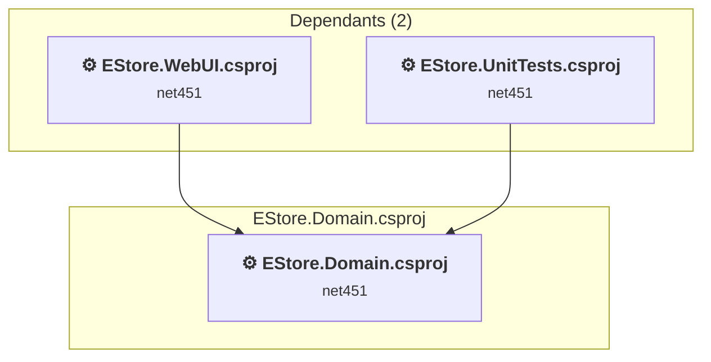
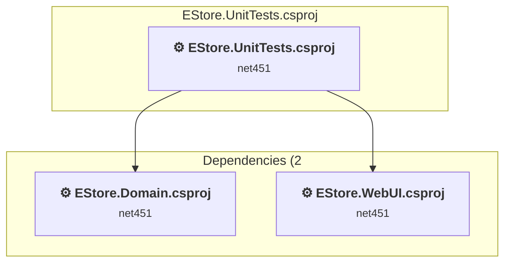
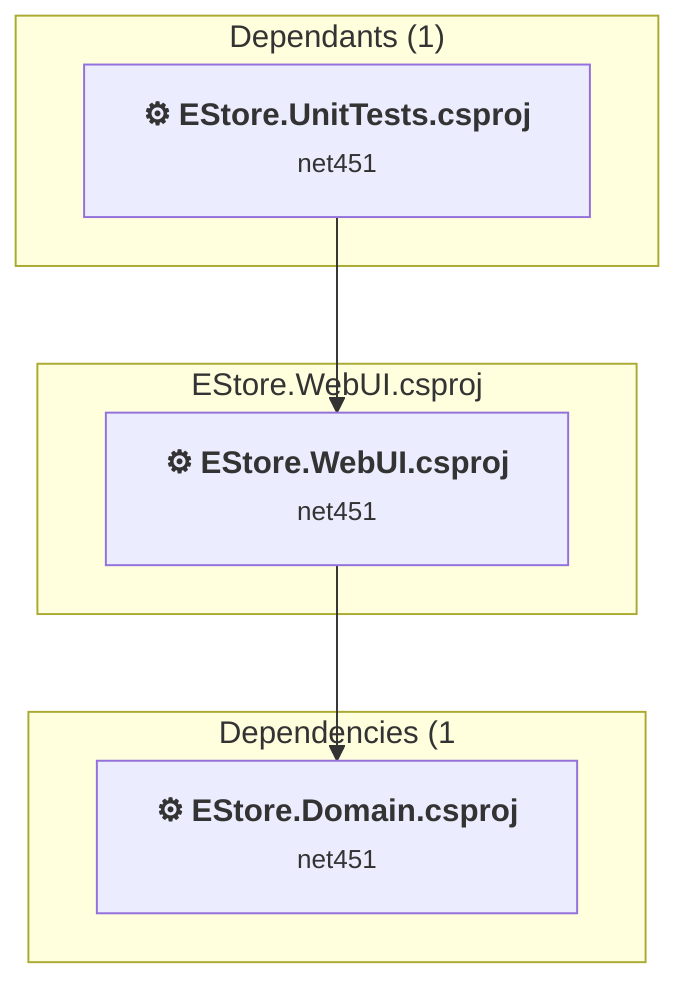

# Projects and dependencies analysis

This document provides a comprehensive overview of the projects and their dependencies in the context of upgrading to .NETCoreApp,Version=v10.0.

## Table of Contents

- [Executive Summary](#executive-Summary)
  - [Highlevel Metrics](#highlevel-metrics)
  - [Projects Compatibility](#projects-compatibility)
  - [Package Compatibility](#package-compatibility)
  - [API Compatibility](#api-compatibility)
  - [Binding Redirect Configuration](#binding-redirect-configuration)
- [Aggregate NuGet packages details](#aggregate-nuget-packages-details)
- [Top API Migration Challenges](#top-api-migration-challenges)
  - [Technologies and Features](#technologies-and-features)
  - [Most Frequent API Issues](#most-frequent-api-issues)
- [Projects Relationship Graph](#projects-relationship-graph)
- [Project Details](#project-details)

  - [EStore.Domain\EStore.Domain.csproj](#estoredomainestoredomaincsproj)
  - [EStore.UnitTests\EStore.UnitTests.csproj](#estoreunittestsestoreunittestscsproj)
  - [EStore.WebUI\EStore.WebUI.csproj](#estorewebuiestorewebuicsproj)

## Executive Summary

### Highlevel Metrics

| Metric | Count | Status |
| :--- | :---: | :--- |
| Total Projects | 3 | All require upgrade |
| Total NuGet Packages | 16 | 13 need upgrade |
| Total Code Files | 46 |  |
| Total Code Files with Incidents | 7 |  |
| Total Lines of Code | 2320 |  |
| Total Number of Issues | 52 |  |
| Estimated LOC to modify | 12+ | at least 0.5% of codebase |

### Projects Compatibility

| Project | Target Framework | Difficulty | Package Issues | API Issues | Binding Issues | Est. LOC Impact | Description |
| :--- | :---: | :---: | :---: | :---: | :---: | :---: | :--- |
| [EStore.Domain\EStore.Domain.csproj](#estoredomainestoredomaincsproj) | net451 | 🟢 Low | 6 | 0 | 1 |  | ClassicClassLibrary, Sdk Style = False |
| [EStore.UnitTests\EStore.UnitTests.csproj](#estoreunittestsestoreunittestscsproj) | net451 | 🟢 Low | 9 | 0 | 1 |  | ClassicClassLibrary, Sdk Style = False |
| [EStore.WebUI\EStore.WebUI.csproj](#estorewebuiestorewebuicsproj) | net451 | 🔴 High | 14 | 12 | 0 | 12+ | Wap, Sdk Style = False |

### Package Compatibility

| Status | Count | Percentage |
| :--- | :---: | :---: |
| ✅ Compatible | 3 | 18.8% |
| ⚠️ Incompatible | 9 | 56.2% |
| 🔄 Upgrade Recommended | 4 | 25.0% |
| ***Total NuGet Packages*** | ***16*** | ***100%*** |

### API Compatibility

| Category | Count | Impact |
| :--- | :---: | :--- |
| 🔴 Binary Incompatible | 8 | High - Require code changes |
| 🟡 Source Incompatible | 4 | Medium - Needs re-compilation and potential conflicting API error fixing |
| 🔵 Behavioral change | 0 | Low - Behavioral changes that may require testing at runtime |
| ✅ Compatible | 933 |  |
| ***Total APIs Analyzed*** | ***945*** |  |

### Binding Redirect Configuration

| Severity | Count | Description |
| :--- | :---: | :--- |
| 🟡Potential | 2 | May cause issues in certain scenarios |
| ***Total Binding Issues*** | ***2*** | ***Across 2 project(s)*** |

## Aggregate NuGet packages details

| Package | Current Version | Suggested Version | Projects | Description |
| :--- | :---: | :---: | :--- | :--- |
| bootstrap | 3.3.2 | 5.3.8 | [EStore.WebUI.csproj](#estorewebuiestorewebuicsproj) | NuGet package contains security vulnerability |
| EntityFramework | 6.1.2 | 6.5.2 | [EStore.Domain.csproj](#estoredomainestoredomaincsproj) [EStore.WebUI.csproj](#estorewebuiestorewebuicsproj) | NuGet package upgrade is recommended |
| jQuery | 2.1.3 | 3.7.1 | [EStore.WebUI.csproj](#estorewebuiestorewebuicsproj) | NuGet package contains security vulnerability |
| jQuery.Migrate | 1.2.1 |  | [EStore.WebUI.csproj](#estorewebuiestorewebuicsproj) | ✅Compatible |
| jQuery.Validation | 1.13.1 | 1.21.0 | [EStore.WebUI.csproj](#estorewebuiestorewebuicsproj) | NuGet package contains security vulnerability |
| Microsoft.AspNet.Mvc | 5.2.3 |  | [EStore.Domain.csproj](#estoredomainestoredomaincsproj) [EStore.UnitTests.csproj](#estoreunittestsestoreunittestscsproj) [EStore.WebUI.csproj](#estorewebuiestorewebuicsproj) | ⚠️NuGet package is incompatible |
| Microsoft.AspNet.Razor | 3.2.3 |  | [EStore.Domain.csproj](#estoredomainestoredomaincsproj) [EStore.UnitTests.csproj](#estoreunittestsestoreunittestscsproj) [EStore.WebUI.csproj](#estorewebuiestorewebuicsproj) | ⚠️NuGet package is incompatible |
| Microsoft.AspNet.WebPages | 3.2.3 |  | [EStore.Domain.csproj](#estoredomainestoredomaincsproj) [EStore.UnitTests.csproj](#estoreunittestsestoreunittestscsproj) [EStore.WebUI.csproj](#estorewebuiestorewebuicsproj) | ⚠️NuGet package is incompatible |
| Microsoft.jQuery.Unobtrusive.Validation | 3.0.0 |  | [EStore.WebUI.csproj](#estorewebuiestorewebuicsproj) | ✅Compatible |
| Microsoft.Web.Infrastructure | 1.0.0.0 |  | [EStore.Domain.csproj](#estoredomainestoredomaincsproj) [EStore.UnitTests.csproj](#estoreunittestsestoreunittestscsproj) [EStore.WebUI.csproj](#estorewebuiestorewebuicsproj) | ⚠️NuGet package is incompatible |
| Moq | 4.2.1502.0911 | 4.20.72 | [EStore.UnitTests.csproj](#estoreunittestsestoreunittestscsproj) [EStore.WebUI.csproj](#estorewebuiestorewebuicsproj) | ⚠️NuGet package is incompatible |
| Ninject | 3.2.2.0 | 3.3.6 | [EStore.UnitTests.csproj](#estoreunittestsestoreunittestscsproj) [EStore.WebUI.csproj](#estorewebuiestorewebuicsproj) | ⚠️NuGet package is incompatible |
| Ninject.MVC3 | 3.2.1.0 |  | [EStore.UnitTests.csproj](#estoreunittestsestoreunittestscsproj) [EStore.WebUI.csproj](#estorewebuiestorewebuicsproj) | ⚠️NuGet package is incompatible |
| Ninject.Web.Common | 3.2.3.0 | 3.3.2 | [EStore.UnitTests.csproj](#estoreunittestsestoreunittestscsproj) [EStore.WebUI.csproj](#estorewebuiestorewebuicsproj) | ⚠️NuGet package is incompatible |
| Ninject.Web.Common.WebHost | 3.2.3.0 |  | [EStore.UnitTests.csproj](#estoreunittestsestoreunittestscsproj) [EStore.WebUI.csproj](#estorewebuiestorewebuicsproj) | ✅Compatible |
| WebActivatorEx | 2.0.6 |  | [EStore.UnitTests.csproj](#estoreunittestsestoreunittestscsproj) [EStore.WebUI.csproj](#estorewebuiestorewebuicsproj) | ⚠️NuGet package is incompatible |

## Top API Migration Challenges

### Technologies and Features

| Technology | Issues | Percentage | Migration Path |
| :--- | :---: | :---: | :--- |
| ASP.NET Framework (System.Web) | 10 | 83.3% | Legacy ASP.NET Framework APIs for web applications (System.Web.*) that don't exist in ASP.NET Core due to architectural differences. ASP.NET Core represents a complete redesign of the web framework. Migrate to ASP.NET Core equivalents or consider System.Web.Adapters package for compatibility. |
| Legacy Configuration System | 2 | 16.7% | Legacy XML-based configuration system (app.config/web.config) that has been replaced by a more flexible configuration model in .NET Core. The old system was rigid and XML-based. Migrate to Microsoft.Extensions.Configuration with JSON/environment variables; use System.Configuration.ConfigurationManager NuGet package as interim bridge if needed. |

### Most Frequent API Issues

| API | Count | Percentage | Category |
| :--- | :---: | :---: | :--- |
| T:System.Web.Security.FormsAuthentication | 2 | 16.7% | Binary Incompatible |
| T:System.Web.Routing.RouteCollection | 2 | 16.7% | Binary Incompatible |
| M:System.Web.Security.FormsAuthentication.SetAuthCookie(System.String,System.Boolean) | 1 | 8.3% | Binary Incompatible |
| M:System.Web.Security.FormsAuthentication.Authenticate(System.String,System.String) | 1 | 8.3% | Binary Incompatible |
| T:System.Configuration.ConfigurationManager | 1 | 8.3% | Source Incompatible |
| P:System.Configuration.ConfigurationManager.AppSettings | 1 | 8.3% | Source Incompatible |
| T:System.Web.Routing.RouteTable | 1 | 8.3% | Binary Incompatible |
| P:System.Web.Routing.RouteTable.Routes | 1 | 8.3% | Binary Incompatible |
| M:System.Web.HttpApplication.#ctor | 1 | 8.3% | Source Incompatible |
| T:System.Web.HttpApplication | 1 | 8.3% | Source Incompatible |

## Projects Relationship Graph

Legend:
📦 SDK-style project
⚙️ Classic project

## Project Details

### EStore.Domain\EStore.Domain.csproj

#### Project Info

- **Current Target Framework:** net451
- **Proposed Target Framework:** net10.0
- **SDK-style**: False
- **Project Kind:** ClassicClassLibrary
- **Dependencies**: 0
- **Dependants**: 2
- **Number of Files**: 9
- **Number of Files with Incidents**: 1
- **Lines of Code**: 373
- **Estimated LOC to modify**: 0+ (at least 0.0% of the project)

#### Dependency Graph

Legend:
📦 SDK-style project
⚙️ Classic project

### API Compatibility

| Category | Count | Impact |
| :--- | :---: | :--- |
| 🔴 Binary Incompatible | 0 | High - Require code changes |
| 🟡 Source Incompatible | 0 | Medium - Needs re-compilation and potential conflicting API error fixing |
| 🔵 Behavioral change | 0 | Low - Behavioral changes that may require testing at runtime |
| ✅ Compatible | 258 |  |
| ***Total APIs Analyzed*** | ***258*** |  |

#### Binding Redirect Configuration

| Rule | Severity | Details | Recommendation |
| :--- | :---: | :--- | :--- |
| AutoGenerateBindingRedirects not set and no manual redirects | 🟡Potential | AutoGenerateBindingRedirects is not set in EStore.Domain.csproj, no manual redirects found | Explicitly enable <AutoGenerateBindingRedirects>true</AutoGenerateBindingRedirects> or add manual binding redirects. |

### EStore.UnitTests\EStore.UnitTests.csproj

#### Project Info

- **Current Target Framework:** net451
- **Proposed Target Framework:** net10.0
- **SDK-style**: False
- **Project Kind:** ClassicClassLibrary
- **Dependencies**: 2
- **Dependants**: 0
- **Number of Files**: 6
- **Number of Files with Incidents**: 1
- **Lines of Code**: 808
- **Estimated LOC to modify**: 0+ (at least 0.0% of the project)

#### Dependency Graph

Legend:
📦 SDK-style project
⚙️ Classic project

### API Compatibility

| Category | Count | Impact |
| :--- | :---: | :--- |
| 🔴 Binary Incompatible | 0 | High - Require code changes |
| 🟡 Source Incompatible | 0 | Medium - Needs re-compilation and potential conflicting API error fixing |
| 🔵 Behavioral change | 0 | Low - Behavioral changes that may require testing at runtime |
| ✅ Compatible | 462 |  |
| ***Total APIs Analyzed*** | ***462*** |  |

#### Binding Redirect Configuration

| Rule | Severity | Details | Recommendation |
| :--- | :---: | :--- | :--- |
| AutoGenerateBindingRedirects not set and no manual redirects | 🟡Potential | AutoGenerateBindingRedirects is not set in EStore.UnitTests.csproj, no manual redirects found | Explicitly enable <AutoGenerateBindingRedirects>true</AutoGenerateBindingRedirects> or add manual binding redirects. |

### EStore.WebUI\EStore.WebUI.csproj

#### Project Info

- **Current Target Framework:** net451
- **Proposed Target Framework:** net10.0
- **SDK-style**: False
- **Project Kind:** Wap
- **Dependencies**: 1
- **Dependants**: 1
- **Number of Files**: 59
- **Number of Files with Incidents**: 5
- **Lines of Code**: 1139
- **Estimated LOC to modify**: 12+ (at least 1.1% of the project)

#### Dependency Graph

Legend:
📦 SDK-style project
⚙️ Classic project

### API Compatibility

| Category | Count | Impact |
| :--- | :---: | :--- |
| 🔴 Binary Incompatible | 8 | High - Require code changes |
| 🟡 Source Incompatible | 4 | Medium - Needs re-compilation and potential conflicting API error fixing |
| 🔵 Behavioral change | 0 | Low - Behavioral changes that may require testing at runtime |
| ✅ Compatible | 213 |  |
| ***Total APIs Analyzed*** | ***225*** |  |

#### Project Technologies and Features

| Technology | Issues | Percentage | Migration Path |
| :--- | :---: | :---: | :--- |
| Legacy Configuration System | 2 | 16.7% | Legacy XML-based configuration system (app.config/web.config) that has been replaced by a more flexible configuration model in .NET Core. The old system was rigid and XML-based. Migrate to Microsoft.Extensions.Configuration with JSON/environment variables; use System.Configuration.ConfigurationManager NuGet package as interim bridge if needed. |
| ASP.NET Framework (System.Web) | 10 | 83.3% | Legacy ASP.NET Framework APIs for web applications (System.Web.*) that don't exist in ASP.NET Core due to architectural differences. ASP.NET Core represents a complete redesign of the web framework. Migrate to ASP.NET Core equivalents or consider System.Web.Adapters package for compatibility. |

