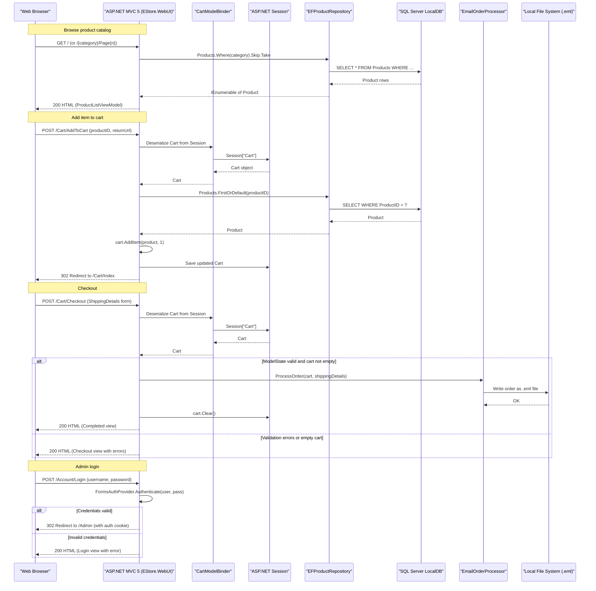

# API & Service Communication Contracts

The EStore application exposes a single deployable web application with 14 HTTP endpoints served via ASP.NET MVC 5 across 5 controllers; all communication is synchronous browser-to-server with no inter-service messaging or API gateway.

## Service Catalog

| Service | Port | Category | Purpose |
|---------|------|----------|---------|
| EStore.WebUI | 80 / 443 (IIS) | Business | Main web application — product catalog, cart, checkout, admin, authentication |
| EStore.Domain | n/a (library) | Business | Domain logic and data access — repository, order processing, EF DbContext |
| EStore.UnitTests | n/a (test) | Infrastructure | MSTest unit test project for controllers, cart, and admin security |

## API Endpoints Inventory

| Controller | Method | Path | Request Type | Response Type |
|-----------|--------|------|-------------|--------------|
| ProductController | GET | `/` | query: `category` (string), `page` (int, default 1) | View (`ProductListViewModel`) |
| ProductController | GET | `/{category}` | path: `category` (string); query: `page` (int) | View (`ProductListViewModel`) |
| ProductController | GET | `/Page{page}` | path: `page` (int) | View (`ProductListViewModel`) |
| ProductController | GET | `/{category}/Page{page}` | path: `category`, `page` | View (`ProductListViewModel`) |
| NavController | GET | (child action — rendered by layout) | query: `category` (string) | PartialView (category list) |
| CartController | GET | `/Cart/Index` | query: `returnUrl` (string); model-bound `Cart` | View (`CartIndexViewModel`) |
| CartController | POST | `/Cart/AddToCart` | form: `productID` (int), `returnUrl`; model-bound `Cart` | Redirect to `Cart/Index` |
| CartController | POST | `/Cart/RemoveFromCart` | form: `productID` (int), `returnUrl`; model-bound `Cart` | Redirect to `Cart/Index` |
| CartController | GET | `/Cart/Summary` | model-bound `Cart` | PartialView (cart summary) |
| CartController | GET | `/Cart/Checkout` | none | View (`ShippingDetails`) |
| CartController | POST | `/Cart/Checkout` | form: `ShippingDetails`; model-bound `Cart` | View (Completed or re-render with errors) |
| AdminController | GET | `/Admin` | none (requires auth) | View (product list) |
| AdminController | GET | `/Admin/Edit/{productID}` | path: `productID` (int); requires auth | View (`Product`) |
| AdminController | POST | `/Admin/Edit` | form: `Product`; requires auth | Redirect to `Admin/Index` or re-render |
| AdminController | GET | `/Admin/Create` | none; requires auth | View (empty `Product`) |
| AdminController | POST | `/Admin/Delete/{productID}` | path: `productID` (int); requires auth | Redirect to `Admin/Index` |
| AccountController | GET | `/Account/Login` | query: `returnUrl` (string) | View (`LoginViewModel`) |
| AccountController | POST | `/Account/Login` | form: `LoginViewModel`, `returnUrl` | Redirect to Admin or re-render |

## Management & Observability Endpoints

| Service | Endpoint | Custom Metrics |
|---------|----------|---------------|
| EStore.WebUI | None configured | None |

> Note: No health check, Swagger/OpenAPI, or metrics endpoints are configured. The application relies entirely on IIS/ASP.NET runtime error pages.

## DTOs & Contracts

All contracts are service-level MVC ViewModels — there is no API gateway aggregation layer:

| Class | Role | Notes |
|-------|------|-------|
| `ProductListViewModel` | Response (catalog views) | Wraps `IEnumerable<Product>`, `PagingInfo`, and current category string |
| `PagingInfo` | Embedded response model | Computes `TotalPages` from `TotalItems` and `ItemsPerPage`; passed inside `ProductListViewModel` |
| `CartIndexViewModel` | Response (cart view) | Wraps `Cart` entity and `returnUrl` string |
| `LoginViewModel` | Request (login form) | Carries `UserName` and `Password`; validated by `ModelState` |
| `Product` | Request + Response (admin) | Domain entity used directly as both form input and view model in Admin controller |
| `ShippingDetails` | Request (checkout form) | Carries shipping address fields; validated by `ModelState` |
| `Cart` | Session-bound model | Not a DTO — bound from ASP.NET Session via `CartModelBinder`; contains `IList<CartLine>` |

No OpenAPI/Swagger specification, protobuf schemas, or GraphQL schemas are present. Serialization is via standard MVC model binding (form-encoded POST bodies); there is no JSON API surface.

## Communication Patterns

**Synchronous only**: All communication is synchronous HTTP request/response between the browser and the ASP.NET MVC application. There is no inter-service communication, message queue, event bus, or gRPC.

**Cart state via ASP.NET Session**: The `Cart` object is serialized/deserialized from `HttpSessionState` on every request by a custom `CartModelBinder`, providing implicit "persistence" across page loads without database storage.

**Order processing**: The `IOrderProcessor` → `EmailOrderProcessor` call is synchronous within the HTTP request pipeline. In production/development, it writes a `.eml` file to a local folder rather than invoking an SMTP server.

**Resilience patterns**: None configured. No circuit breaker, retry policy, timeout, or bulkhead pattern is implemented. A failure in the database or email/file write will surface directly to the end user as an unhandled exception.

**Service discovery**: Not applicable — single monolithic web application with a single database connection string hardcoded in `Web.config`.

**Security posture**: Authentication is implemented via ASP.NET Forms Authentication with a hardcoded credential (`admin` / `password`) checked in `Web.config`. The `AdminController` is protected with `[Authorize]`, which redirects unauthenticated requests to `/Account/Login`. All other controllers and endpoints are publicly accessible with no authorization checks. No transport security (HTTPS/TLS) is configured in the application (left to IIS/hosting environment). No token-based authentication, OAuth2, or CSRF protection beyond the default MVC `AntiForgeryToken` (which does not appear to be applied to all POST actions) is present.

## Service Technology Matrix

| Service | Web Framework | Data Access | Discovery | Gateway | Health Checks | Cache | Metrics |
|---------|--------------|------------|-----------|---------|--------------|-------|---------|
| EStore.WebUI | ASP.NET MVC 5 | EF 6 (via Domain) | None | None | None | ASP.NET Session | None |
| EStore.Domain | n/a (library) | Entity Framework 6 | None | None | None | None | None |

## Service Communication Sequence

