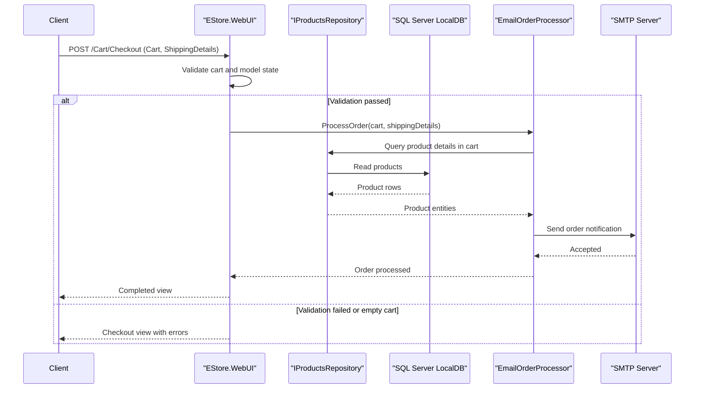

# API & Service Communication Contracts

This document captures the API surface of EStore's MVC application, which is primarily server-rendered endpoints with synchronous in-process communication to domain and persistence services.

## Service Catalog

| Service | Port | Category | Purpose |
|---|---|---|---|
| EStore.WebUI | IIS Express (project URL on localhost) | API Layer | MVC entry point for catalog, cart, admin, and account workflows |
| EStore.Domain | In-process library | Business | Product repository abstraction and order processing logic |
| SMTP Server | 587 (configured default) | Infrastructure | External mail transport for checkout order notifications |

## API Endpoints Inventory

| Service | Method | Path | Request Type | Response Type |
|---|---|---|---|---|
| ProductController | GET | `/`, `/{category}`, `/Page{page}`, `/{category}/Page{page}` | Query/path (`category`, `page`) | HTML view (`ProductListViewModel`) |
| CartController | GET | `/Cart/Index` | Query (`returnUrl`) + bound `Cart` | HTML view (`CartIndexViewModel`) |
| CartController | POST | `/Cart/AddToCart` | Form/body (`productID`, `returnUrl`) + bound `Cart` | Redirect to `Cart/Index` |
| CartController | POST | `/Cart/RemoveFromCart` | Form/body (`productID`, `returnUrl`) + bound `Cart` | Redirect to `Cart/Index` |
| CartController | GET | `/Cart/Checkout` | None | HTML view (`ShippingDetails`) |
| CartController | POST | `/Cart/Checkout` | Form/body (`ShippingDetails`) + bound `Cart` | HTML view (`Completed` or validation errors) |
| CartController | GET | `/Cart/Summary` | Bound `Cart` | Partial view |
| AdminController | GET | `/Admin`, `/Admin/Index` | None | HTML view (products list) |
| AdminController | GET | `/Admin/Edit/{productID}` | Path (`productID`) | HTML view (`Product`) |
| AdminController | POST | `/Admin/Edit` | Form/body (`Product`) | Redirect or HTML view |
| AdminController | GET | `/Admin/Create` | None | HTML view (`Product`) |
| AdminController | POST | `/Admin/Delete/{productID}` | Path/form (`productID`) | Redirect |
| AccountController | GET | `/Account/Login` | None | HTML view |
| AccountController | POST | `/Account/Login` | Form/body (`LoginViewModel`, `returnUrl`) | Redirect or HTML view |
| NavController | GET | `/Nav/Menu` | Query (`category`) | Partial view (`IEnumerable<string>`) |

## Management & Observability Endpoints

| Service | Endpoint | Custom Metrics (if any) |
|---|---|---|
| EStore.WebUI | None detected (`/health`, `/swagger`, and actuator-style endpoints not configured) | None detected |

## DTOs & Contracts

The API contracts are MVC model-based: `ProductListViewModel`, `CartIndexViewModel`, `LoginViewModel`, and `ShippingDetails` drive request/response interactions for views. Service-level domain entities include `Product`, `Cart`, and `CartLine`; these are mutable C# classes. No OpenAPI/Swagger spec, protobuf schema, or GraphQL schema was found. Serialization is conventional ASP.NET MVC model binding and view rendering.

## Communication Patterns

All application communication is synchronous. Browser requests hit MVC controllers, which call domain abstractions (`IProductsRepository`, `IOrderProcessor`, `IAuthProvider`) through Ninject dependency injection. Data access goes through Entity Framework to SQL Server LocalDB. Checkout sends order messages to SMTP through `EmailOrderProcessor`. No asynchronous message broker, circuit breaker, retry library, or service discovery mechanism was detected. Security posture: Forms Authentication is configured, admin endpoints are protected with `[Authorize]`, and no explicit TLS enforcement settings were found in project configuration.

## Service Technology Matrix

| Service | Web | Data Access | Discovery | Gateway | Actuator | Cache | Metrics |
|---|---|---|---|---|---|---|---|
| EStore.WebUI | ASP.NET MVC 5 | Via `IProductsRepository` to EF6 | None | None | None | Session cart model binder | None |
| EStore.Domain | N/A | Entity Framework 6 (`EFDbContext`) | None | None | None | None | None |

## Service Communication Sequence

