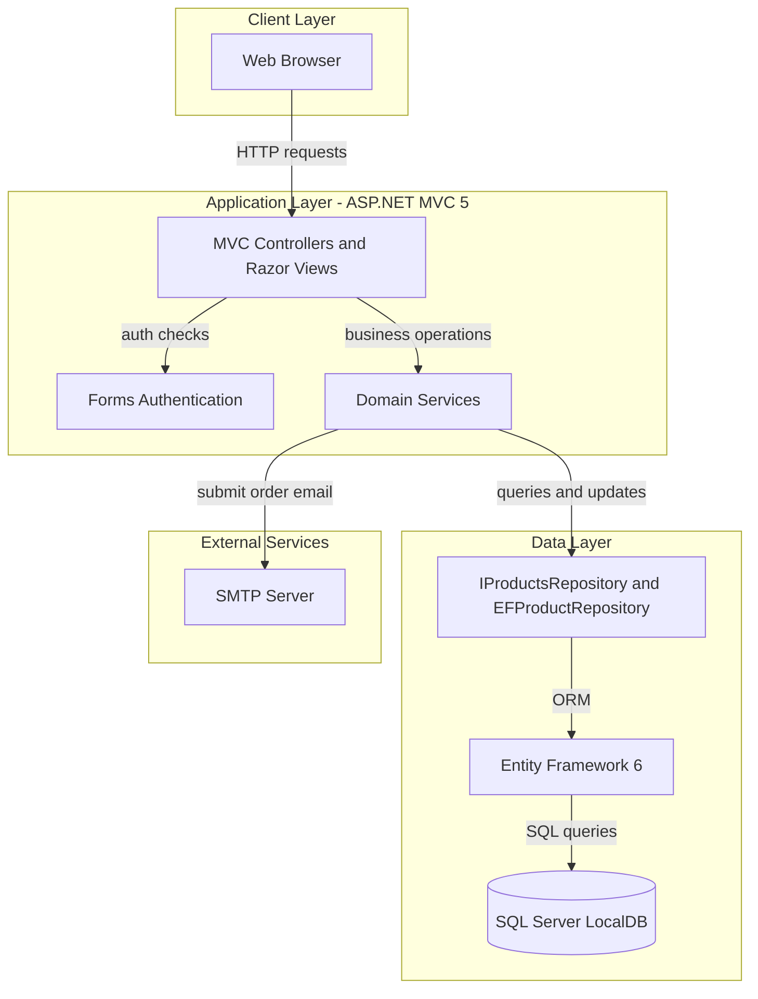
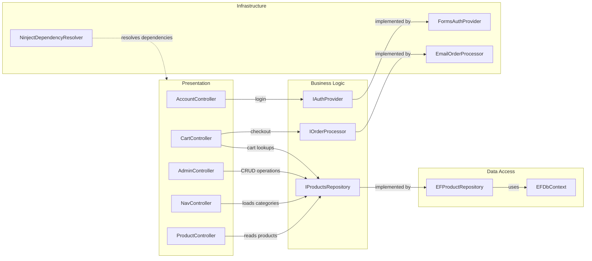

# Architecture Diagram

This document summarizes the EStore application's high-level architecture and key component relationships.

## Application Architecture

### Technology Stack Summary

| Layer | Technology | Version | Purpose |
|---|---|---|---|
| Presentation | ASP.NET MVC | 5.2.3 | Server-side web UI and routing |
| Domain | C# class library | .NET Framework 4.5.1 | Business logic and order processing |
| Data Access | Entity Framework | 6.1.2 | ORM access to products |
| Dependency Injection | Ninject | 3.2.x | Controller and service wiring |
| Authentication | Forms Authentication | .NET Framework | Admin login and authorization |

### Data Storage & External Services

The application stores product data in SQL Server LocalDB through Entity Framework. Order checkout also integrates with SMTP to submit order notifications.

### Key Architectural Decisions

- Uses a classic three-layer ASP.NET MVC architecture with a separate domain project.
- Uses repository abstraction (`IProductsRepository`) to isolate controller logic from EF implementation.
- Uses Forms Authentication and `[Authorize]` for admin-only product management flows.

## Component Relationships

### Component Inventory

| Component | Layer | Type | Responsibility |
|---|---|---|---|
| ProductController | Presentation | MVC Controller | Lists products and supports pagination/category filtering |
| CartController | Presentation | MVC Controller | Manages cart actions and checkout flow |
| AdminController | Presentation | MVC Controller | Admin product management (secured) |
| AccountController | Presentation | MVC Controller | Handles user login |
| NavController | Presentation | MVC Controller | Provides category navigation menu |
| IProductsRepository | Business Logic | Interface | Product persistence contract |
| IOrderProcessor | Business Logic | Interface | Checkout order processing contract |
| IAuthProvider | Business Logic | Interface | Authentication contract |
| EFProductRepository | Data Access | Repository | EF-based product CRUD |
| EFDbContext | Data Access | DbContext | EF database context for Product set |
| FormsAuthProvider | Infrastructure | Provider | Forms authentication implementation |
| EmailOrderProcessor | Infrastructure | Service | Sends checkout order details via SMTP |
