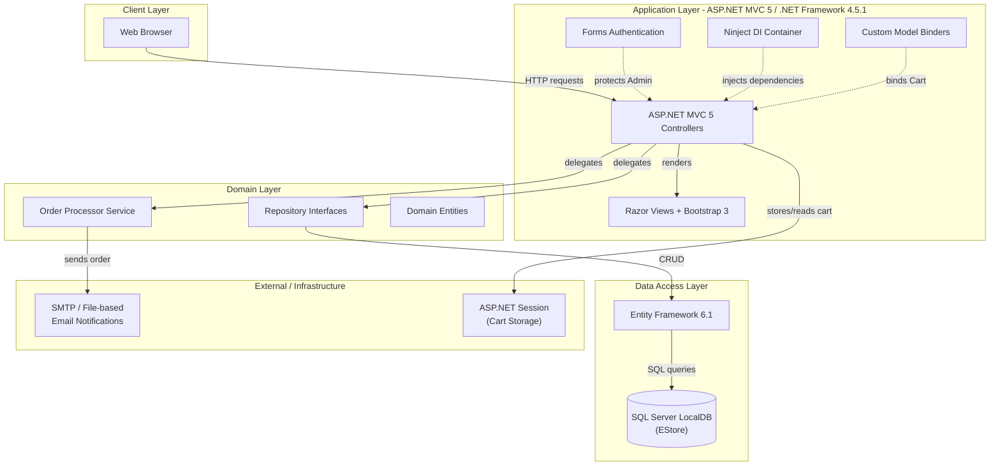
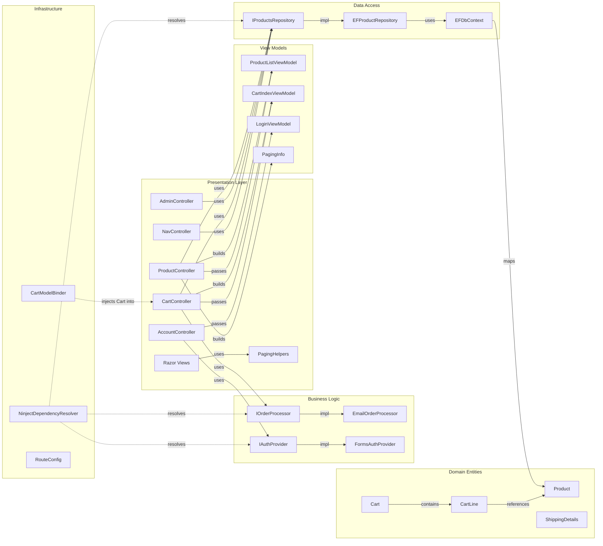

# Architecture Diagram

This document provides a two-layer architecture visualization of the EStore ASP.NET MVC e-commerce application: a high-level application architecture diagram and a detailed component relationship diagram.

## Application Architecture

### Technology Stack Summary

| Layer | Technology | Version | Purpose |
|-------|-----------|---------|---------|
| Presentation | ASP.NET MVC 5 | 5.2.3 | Server-side MVC web framework |
| Presentation | Razor Views | 5.x | HTML templating engine |
| Presentation | Bootstrap | 3.x | Responsive UI framework |
| Presentation | jQuery | 2.1.3 | Client-side scripting |
| Business Logic | .NET Framework | 4.5.1 | Runtime platform |
| Business Logic | Ninject | 3.2.2 | Dependency injection container |
| Data Access | Entity Framework | 6.1.2 | ORM for database access |
| Database | SQL Server LocalDB | v11.0 | Relational data storage |
| Authentication | ASP.NET Forms Auth | built-in | Role-based access control |

### Data Storage & External Services

The application uses a single SQL Server LocalDB instance (named `EStore`) accessed through Entity Framework 6 Code First. The database stores the `Products` table via the `EFDbContext`. Shopping cart state is maintained in ASP.NET Session (in-process), not persisted to the database. Order notifications are handled by `EmailOrderProcessor`, which is configured in development mode to write `.eml` files to a local folder (`c:\sports_store_emails`) rather than sending actual emails via SMTP.

### Key Architectural Decisions

- **Repository pattern**: `IProductsRepository` is implemented by `EFProductRepository`, decoupling business logic from Entity Framework; this enables test mocking via `Moq`.
- **Session-based cart with custom model binder**: `CartModelBinder` automatically deserializes the `Cart` from ASP.NET Session for controller actions, keeping cart management transparent.
- **Ninject for dependency injection**: `NinjectWebCommon` wires up all interface-to-concrete bindings at startup, enabling testable, loosely coupled components.

## Component Relationships

### Component Inventory

| Component | Layer | Type | Responsibility |
|-----------|-------|------|---------------|
| ProductController | Presentation | MVC Controller | Product catalog listing, filtering by category, pagination |
| AdminController | Presentation | MVC Controller | Admin CRUD for products (protected by [Authorize]) |
| CartController | Presentation | MVC Controller | Shopping cart add/remove/checkout, order submission |
| NavController | Presentation | MVC Controller | Dynamic category navigation menu (child action) |
| AccountController | Presentation | MVC Controller | Admin login/logout via forms authentication |
| PagingHelpers | Presentation | HTML Helper | Renders pagination link elements in Razor views |
| ProductListViewModel | View Models | ViewModel | Carries product list + paging info + current category to view |
| CartIndexViewModel | View Models | ViewModel | Carries Cart and return URL to cart view |
| LoginViewModel | View Models | ViewModel | Carries username/password for login form |
| PagingInfo | View Models | Model | Calculates total pages for pagination |
| IOrderProcessor | Business Logic | Interface | Contract for order processing/notification |
| EmailOrderProcessor | Business Logic | Service | Sends order as email (or writes .eml file in dev mode) |
| IAuthProvider | Business Logic | Interface | Contract for authentication operations |
| FormsAuthProvider | Business Logic | Service | Wraps ASP.NET FormsAuthentication APIs |
| IProductsRepository | Data Access | Interface | Contract for product CRUD data access |
| EFProductRepository | Data Access | Repository | Entity Framework implementation of IProductsRepository |
| EFDbContext | Data Access | DbContext | Entity Framework context exposing Products DbSet |
| Product | Domain Entities | Entity | Core product domain entity (name, price, category, etc.) |
| Cart | Domain Entities | Domain Model | In-memory shopping cart with line items |
| CartLine | Domain Entities | Value Object | Single product-quantity pair within a Cart |
| ShippingDetails | Domain Entities | Entity | Customer shipping address for order checkout |
| CartModelBinder | Infrastructure | Model Binder | Deserializes Cart from ASP.NET Session automatically |
| NinjectDependencyResolver | Infrastructure | DI Resolver | Registers Ninject as MVC's dependency resolver |
| RouteConfig | Infrastructure | Configuration | Defines custom URL routing rules |
