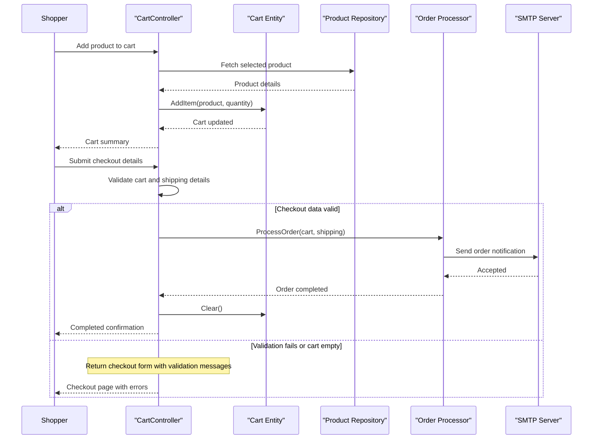

# Core Business Workflows

This document describes EStore's core commerce workflows: browsing products, managing a cart, and completing checkout with administrative product management.

## Domain Entities

| Entity | Service / Bounded Context | Description | Key Relationships |
|---|---|---|---|
| Product | Catalog Management | Sellable catalog item managed by admins and shown to shoppers | Appears in CartLine entries |
| Cart | Shopping Context | Buyer's transient order-in-progress | Contains CartLine items |
| CartLine | Shopping Context | Quantity of a selected product | References Product |
| ShippingDetails | Checkout Context | Shipping information provided at purchase time | Used by checkout/order processing |

## Service-to-Domain Mapping

| Service | Domain Context | Owned Entities | External Dependencies |
|---|---|---|---|
| EStore.WebUI | Storefront and Admin UI | Cart workflow state and view models | EStore.Domain, ASP.NET Forms Auth |
| EStore.Domain | Catalog and Order Processing | Product, ShippingDetails processing logic | SQL Server via EF, SMTP mail server |

## Primary Workflows

### Workflow 1: Browse catalog and filter products

1. Shopper lands on product listing routes.
2. `ProductController.List` queries repository products.
3. Optional category and page filters are applied.
4. Results are rendered as paginated product views.

### Workflow 2: Add/remove cart items and checkout

1. Shopper posts add/remove actions from product pages.
2. Cart state is mutated through `Cart` domain behavior.
3. At checkout, shipping details and cart contents are validated.
4. Valid orders are processed through `IOrderProcessor`, then cart is cleared and completion view is shown.

### Workflow 3: Admin product management

1. Admin authenticates through account login.
2. Authorized admin visits product index.
3. Admin creates, edits, or deletes products.
4. Product repository persists changes and UI shows confirmation messages.

## Cross-Service Data Flows

The application is a single deployable web app with in-process domain service calls. Controllers retrieve and mutate product data through repository abstractions that delegate to EF and SQL Server LocalDB. Checkout flow composes cart data with shipping details and passes it to email order processing, which sends order summaries through SMTP. If order validation fails (empty cart or invalid model), the workflow degrades by returning the checkout form with errors.

## Business Workflow Sequence

## Business Rules & Decision Logic

- Product records require core fields (name, description, category, positive price) before save.
- Checkout is blocked when cart has no lines.
- Checkout proceeds only when model validation succeeds for shipping details.
- Admin management actions are role-gated through forms authentication and `[Authorize]`.
- Successful checkout triggers side-effect notification through email order processor.
