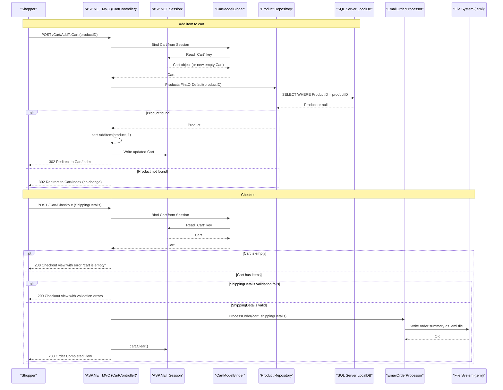

# Core Business Workflows

EStore is a basic online e-commerce store that allows shoppers to browse and filter a product catalog, manage a shopping cart, and place orders, while administrators can manage the product inventory through a protected admin interface.

## Domain Entities

| Entity | Service / Bounded Context | Description | Key Relationships |
|--------|--------------------------|-------------|------------------|
| Product | Catalog Management | A sellable item with a name, description, price, and category. The core catalog entity persisted in the database. | Referenced by CartLine; administered via Admin workflow |
| Cart | Shopping Cart | A transient, session-scoped collection of line items representing a shopper's current selection. Not persisted to the database. | Contains one or more CartLines; submitted with ShippingDetails at checkout |
| CartLine | Shopping Cart | A single product-quantity pair within a Cart. Represents the quantity of a specific Product added to the cart. | Child of Cart; references Product |
| ShippingDetails | Order Fulfillment | Customer shipping address and gift-wrap preference captured during checkout. Used to generate the order notification. | Associated with Cart at checkout time; passed to order processor |

## Service-to-Domain Mapping

| Service | Domain Context | Owned Entities | External Dependencies |
|---------|---------------|---------------|----------------------|
| EStore.Domain | Catalog Management + Order Fulfillment | Product, Cart, CartLine, ShippingDetails, EmailSettings | SQL Server LocalDB (Products table) |
| EStore.WebUI | Presentation + Shopping Cart + Admin | (ViewModels only: ProductListViewModel, CartIndexViewModel, LoginViewModel, PagingInfo) | EStore.Domain via IProductsRepository and IOrderProcessor |

## Primary Workflows

### Workflow 1: Browse and Filter Product Catalog

A shopper visits the home page or navigates to a category. The `ProductController.List` action retrieves products from the repository, applies optional category filtering, and applies pagination (4 items per page). The result is displayed using the `ProductListViewModel`, which also drives the pagination helper. The `NavController.Menu` child action independently queries distinct categories to build the navigation sidebar.

**Steps:**
1. Shopper requests `/` or `/{category}` or `/{category}/Page{n}`.
2. `ProductController` queries `IProductsRepository.Products` with optional `Where(category)`, ordered by `ProductID`, and paginated with `Skip` / `Take`.
3. `NavController` queries distinct categories to render the sidebar menu.
4. `ProductListViewModel` (products + paging info + current category) is passed to the view.
5. The `PagingHelpers.PageLinks` HTML helper renders page navigation links.

**Business rules:** No authentication required. Products are ordered by ID ascending. Page size is fixed at 4.

---

### Workflow 2: Add / Remove Items from Cart

A shopper adds or removes products from their cart. The `Cart` is bound from ASP.NET Session by `CartModelBinder`, mutated, and automatically serialized back to Session.

**Steps — Add to Cart:**
1. Shopper clicks "Add to Cart" → `POST /Cart/AddToCart` (productID, returnUrl).
2. `CartController` resolves the `Product` from the repository by `productID`.
3. If the product exists, `cart.AddItem(product, 1)` is called:
   - If the product is already in the cart, quantity is incremented.
   - If not, a new `CartLine` is added.
4. Cart is saved back to Session; shopper is redirected to `Cart/Index`.

**Steps — Remove from Cart:**
1. Shopper clicks "Remove" → `POST /Cart/RemoveFromCart` (productID, returnUrl).
2. `CartController` resolves the `Product` from the repository.
3. If found, `cart.RemoveLine(product)` removes the entire CartLine.
4. Cart is saved back to Session; shopper is redirected to `Cart/Index`.

**Business rules:** Adding a product that already exists in the cart increases quantity rather than creating a duplicate line. Removing always removes the full line regardless of quantity.

---

### Workflow 3: Checkout and Order Placement

A shopper reviews their cart and submits shipping details to place an order. The `EmailOrderProcessor` generates an order notification as an email or a local `.eml` file.

**Steps:**
1. Shopper navigates to `GET /Cart/Checkout` → receives the shipping details form.
2. Shopper submits `POST /Cart/Checkout` (ShippingDetails form + Cart from Session).
3. `CartController` checks that the cart is not empty; if empty, adds a model error and re-renders the form.
4. `ModelState.IsValid` validates all required `ShippingDetails` fields.
5. If valid: `IOrderProcessor.ProcessOrder(cart, shippingDetails)` is called.
   - `EmailOrderProcessor` formats a summary of cart lines and totals.
   - It writes the order to `c:\sports_store_emails\` as an `.eml` file (dev mode) or sends via SMTP.
6. Cart is cleared from Session (`cart.Clear()`).
7. Shopper is redirected to the "Completed" view.

**Business rules:** Cannot check out with an empty cart. All ShippingDetails fields except Line2, Line3, State, and Zip are required. Gift wrap is an optional boolean flag.

---

### Workflow 4: Admin Product Management (CRUD)

An authenticated administrator manages the product catalog — listing, creating, editing, and deleting products.

**Steps — List:**
1. Admin navigates to `GET /Admin` → `AdminController.Index` returns all products.

**Steps — Create:**
1. Admin navigates to `GET /Admin/Create` → `AdminController.Create` renders the Edit view with an empty `Product`.
2. Admin submits `POST /Admin/Edit` → `AdminController.Edit(Product)`:
   - `ModelState.IsValid` validates required fields.
   - `ProductID == 0` signals a new product insert.
   - `repository.SaveProduct(product)` adds the new product to the DB.
   - Admin is redirected to the product list with a success message.

**Steps — Edit:**
1. Admin navigates to `GET /Admin/Edit/{productID}` → product is loaded by primary key.
2. Admin submits `POST /Admin/Edit` with updated `Product`:
   - EF-tracked entity fields (Name, Description, Price, Category) are mutated.
   - `context.SaveChanges()` persists the update.

**Steps — Delete:**
1. Admin submits `POST /Admin/Delete/{productID}`:
   - Product is located by primary key; if found, removed and `SaveChanges()` called.
   - Admin is redirected to the list with a confirmation message.

**Business rules:** All admin actions require authentication (`[Authorize]`). Unauthenticated requests are redirected to `/Account/Login`.

---

### Workflow 5: Admin Authentication

An administrator logs in using Forms Authentication with credentials stored in `Web.config`.

**Steps:**
1. Unauthenticated user accesses any Admin page → redirected to `GET /Account/Login`.
2. Admin submits `POST /Account/Login` (username + password).
3. `FormsAuthProvider.Authenticate(userName, password)` calls `FormsAuthentication.Authenticate()`, which checks credentials against the `<credentials>` block in `Web.config`.
4. If valid: `FormsAuthentication.SetAuthCookie()` issues the auth cookie; admin is redirected to `/Admin` or `returnUrl`.
5. If invalid: model error is added and the login view is re-rendered.

## Cross-Service Data Flows

This is a monolithic application — all business logic executes within a single process. There is no inter-service HTTP call, event bus, or message queue. Data flows are:

- **Browser → ASP.NET MVC → Repository → EF → LocalDB**: Product catalog reads and admin CRUD.
- **Browser → ASP.NET MVC → Session (via CartModelBinder)**: Cart state read/write per request.
- **MVC → EmailOrderProcessor → File System**: Order notification written as `.eml` file on checkout.

No circuit breaker fallback behavior applies because there is no remote service dependency. The only external dependency is the LocalDB database — a failure there surfaces as an unhandled exception.

## Business Workflow Sequence

## Business Rules & Decision Logic

### Validation Rules

| Entity / Context | Rule | Enforcement Point |
|-----------------|------|-----------------|
| ShippingDetails | Name, Line1, City, State, Country are required | DataAnnotations + `ModelState.IsValid` in `CartController.Checkout` |
| ShippingDetails | Line2, Line3, Zip are optional | DataAnnotations (`[Display]` only) |
| ShippingDetails | GiftWrap is an optional boolean (defaults to false) | Model default |
| Product | Name, Description, Category are required strings | DataAnnotations + `ModelState.IsValid` in `AdminController.Edit` |
| Product | Price must be > 0.01 and ≤ double.MaxValue | `[Range(0.01, double.MaxValue)]` |
| LoginViewModel | UserName and Password are required | DataAnnotations + `ModelState.IsValid` in `AccountController.Login` |

### Decision Logic

| Decision Point | Condition | Outcome |
|---------------|-----------|---------|
| Cart AddItem | Product already in cart | Increment existing CartLine quantity |
| Cart AddItem | Product not in cart | Add new CartLine |
| Checkout | Cart is empty | Block checkout; add model error |
| Checkout | ShippingDetails validation fails | Re-render form with errors |
| Admin SaveProduct | `ProductID == 0` | Insert new product |
| Admin SaveProduct | `ProductID > 0` | Update existing product by primary key |
| Admin DeleteProduct | Product not found | No-op; no error shown to user |
| Login | Credentials match `Web.config` | Issue auth cookie; redirect to Admin |
| Login | Credentials invalid | Re-render login form with error |
| Email delivery | `Email.WriteAsFile == true` | Write to local file system instead of SMTP |

### State Transitions

| Entity | Transition | Trigger |
|--------|-----------|---------|
| Cart | Empty → Has items | `AddItem` called with valid product |
| Cart | Has items → Item removed | `RemoveLine` called |
| Cart | Any state → Empty | `Clear()` called on successful checkout |

### Cross-Cutting Concerns

- **Transactions**: All EF operations use implicit `SaveChanges()` transactions — no explicit `TransactionScope` or saga pattern.
- **Authorization**: The `[Authorize]` attribute on `AdminController` enforces authentication for all admin actions. All other pages are public.
- **Error handling**: No global exception filter or custom error page is configured beyond ASP.NET's default error handling (`compilation debug="true"` in dev mode shows the yellow screen of death).
- **Audit/logging**: No audit trail, change tracking, or structured logging is implemented. Admin actions log a TempData success message to the UI only.
- **Computed values**: `Cart.ComputeTotalValue()` sums `Price × Quantity` across all CartLines. `PagingInfo.TotalPages` is computed as `Ceiling(TotalItems / ItemsPerPage)`.
