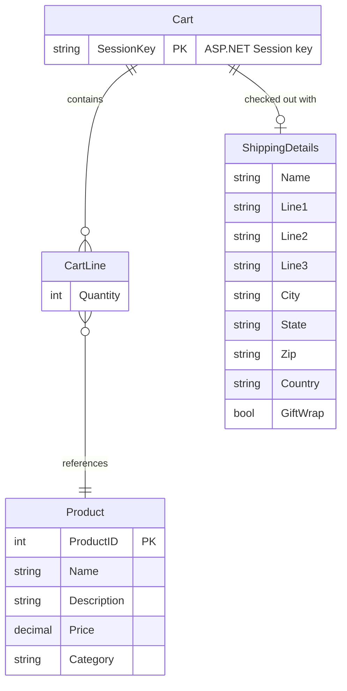

# Data Architecture & Persistence Layer

The EStore application uses a single SQL Server LocalDB database accessed through Entity Framework 6 (Code First conventions), with one persisted entity (`Product`) and two in-memory domain models (`Cart`, `ShippingDetails`) managed entirely in ASP.NET Session.

## Database Configuration

| Service/Module | DB Type | Profile | Driver | Connection | Migration Tool |
|---------------|---------|---------|--------|-----------|---------------|
| EStore.Domain / EFDbContext | SQL Server LocalDB v11.0 | All (single environment) | System.Data.SqlClient (via EF6 SqlServer provider) | `Data Source=(localdb)\v11.0;Initial Catalog=EStore;Integrated Security=True` | None — EF6 creates schema automatically on first run (CreateDatabaseIfNotExists convention) |

No Flyway, Liquibase, EF Migrations, or other versioned migration tool is configured. The database schema is auto-generated by Entity Framework 6 using its default `CreateDatabaseIfNotExists` initializer. There are no seed data scripts or `import.sql` files present. See `configuration-inventory.md` for the full property inventory.

## Data Ownership per Service

| Service | Tables Owned | ORM Framework | Caching | Notes |
|---------|-------------|--------------|---------|-------|
| EStore.Domain | Products | Entity Framework 6 (Code First) | None | Single DbSet; no migrations; schema created on first run |
| EStore.WebUI | None (reads Domain) | n/a | ASP.NET Session (Cart only) | Cart is serialized to Session — not persisted to DB |

## Entity Model

> Note: `Cart`, `CartLine`, and `ShippingDetails` are in-memory domain models only — they are NOT persisted to the database. Only `Product` maps to a database table. `Cart` is stored in ASP.NET Session keyed by `"Cart"`.

## Key Repository Methods

| Service | Repository | Method Signature | Purpose |
|---------|-----------|-----------------|---------|
| EStore.Domain | `IProductsRepository` | `IEnumerable<Product> Products { get; }` | Returns all products (full table scan via EF LINQ) |
| EStore.Domain | `IProductsRepository` | `void SaveProduct(Product product)` | Upsert: inserts new product (ProductID == 0) or updates existing by finding and mutating tracked entity |
| EStore.Domain | `IProductsRepository` | `Product DeleteProduct(int productID)` | Finds product by ID, removes from DbSet, saves; returns deleted entity or null |
| EStore.Domain | `EFProductRepository` | `context.Products.Find(productID)` | Primary key lookup via EF identity cache + DB query |

> The `Products` property returns a live `IQueryable<Product>` from EF — callers (controllers) apply `.Where()`, `.OrderBy()`, `.Skip()`, `.Take()` for filtering and pagination, which are translated to SQL. No custom named queries or stored procedures are used.

## Caching Strategy

No dedicated caching layer is configured. The only form of state persistence between requests is **ASP.NET in-process Session** used exclusively for the shopping cart (`Cart` object stored under the key `"Cart"`). This is not a cache but a session store.

| Aspect | Detail |
|--------|--------|
| Provider | ASP.NET `InProc` Session State (default) |
| Scope | Per-user browser session |
| TTL | 20 minutes (ASP.NET default) |
| Pattern | Manual read/write via custom `CartModelBinder` |
| Eviction | Session timeout or explicit `cart.Clear()` on checkout |
| Distributed cache | None |
| Query caching | None (EF6 second-level cache not configured) |
| Output caching | None |

The rationale for session-based cart storage is simplicity — no database table is required for transient cart state. The downside is that carts are lost on application restart or IIS recycle, and cannot be shared across web farm nodes without configuring a distributed session provider.

## Data Ownership Boundaries

The application uses a **single shared database** (`EStore` on LocalDB) with a single owner (`EStore.Domain`). There is no database-per-service separation or logical schema isolation. `EStore.WebUI` accesses data exclusively through `IProductsRepository` — it never queries `EFDbContext` directly, maintaining a clean boundary.

**Cross-service data access**: Not applicable — this is a monolithic single-process application. The WebUI project references the Domain project as a compiled assembly and calls repository methods via Ninject-injected interfaces.

**Read/write patterns**: Standard CRUD — reads are via LINQ-to-Entities on the `Products` DbSet; writes use tracked entity mutation + `SaveChanges()`. No CQRS, event sourcing, or read model separation is in place.

### Data Classification & Sensitivity

| Entity | Sensitive Fields | Classification | Controls in Place |
|--------|-----------------|---------------|------------------|
| Product | None | None | n/a |
| ShippingDetails (in-memory) | Name, Line1–3, City, State, Zip, Country | PII (shipping address + customer name) | None — not persisted to DB; held in ASP.NET Session in plaintext; no encryption-at-rest, masking, or field-level access control |
| Cart / CartLine (in-memory) | None (references Product by ID, stores quantity) | None | n/a |

> **Note**: `ShippingDetails` contains customer PII (name and full shipping address) but is never written to a database — it is used only transiently during checkout to generate an order notification (email or `.eml` file). The `.eml` files written to `c:\sports_store_emails` on disk are unencrypted plaintext and contain customer PII. No encryption-at-rest, access controls, or audit logging is configured for these files.
