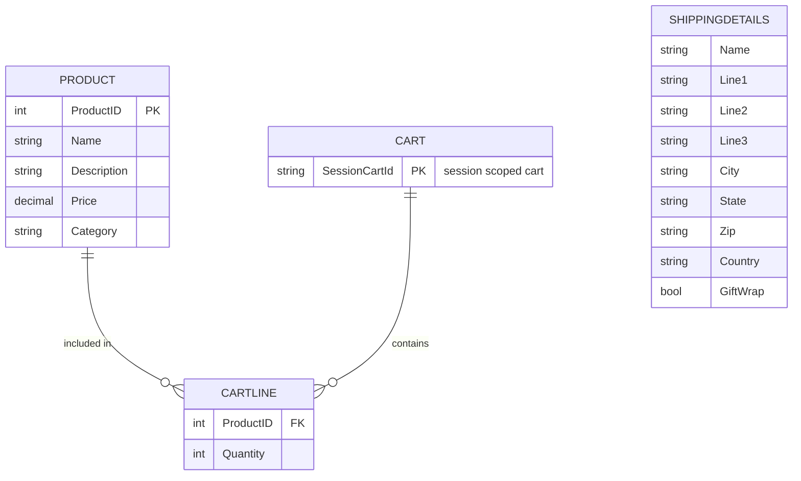

# Data Architecture & Persistence Layer

This document summarizes EStore's persistence design, which centers on a single Entity Framework model for product data plus in-memory/session-backed cart state.

## Database Configuration

| Service/Module | DB Type | Profile | Driver | Connection | Migration Tool |
|---|---|---|---|---|---|
| EStore.WebUI / EStore.Domain | SQL Server LocalDB | Default | System.Data.SqlClient + EF6 provider | `EFDbContext` connection string in Web.config | None detected |

## Data Ownership per Service

| Service | Tables Owned | ORM Framework | Caching | Notes |
|---|---|---|---|---|
| EStore.Domain | Product | Entity Framework 6 | None | Central repository abstraction for product CRUD |
| EStore.WebUI | Session cart state (non-relational) | MVC model binding/session | ASP.NET session-based cart object | Uses `CartModelBinder` to read/write cart in session |

## Entity Model

## Key Repository Methods

| Service | Repository | Notable Methods | Purpose |
|---|---|---|---|
| EStore.Domain | `IProductsRepository` / `EFProductRepository` | `IEnumerable<Product> Products` | Read catalog data for storefront and admin |
| EStore.Domain | `EFProductRepository` | `SaveProduct(Product product)` | Insert/update product records |
| EStore.Domain | `EFProductRepository` | `DeleteProduct(int productID)` | Remove product records |

## Caching Strategy

No dedicated distributed or in-memory cache provider is configured. The application uses session-backed cart state (through the MVC cart model binder) as transient user-specific data storage. Product data is read directly from SQL Server via EF.

## Data Ownership Boundaries

EStore uses a shared monolithic data model, with one primary relational store for product data and no service-isolated databases. Cross-module access is in-process: controllers call domain repositories directly rather than via remote APIs or events. Read/write operations are straightforward CRUD with no CQRS split.

### Data Classification & Sensitivity

| Entity | Sensitive Fields | Classification (PII/PHI/PCI/None) | Controls in Place |
|---|---|---|---|
| Product | None | None | N/A |
| ShippingDetails | Name, Line1, Line2, Line3, City, State, Zip, Country | PII | No explicit encryption/masking controls detected in code/config |
| Cart / CartLine | Product and quantity references | None | Session-scoped in application runtime |
