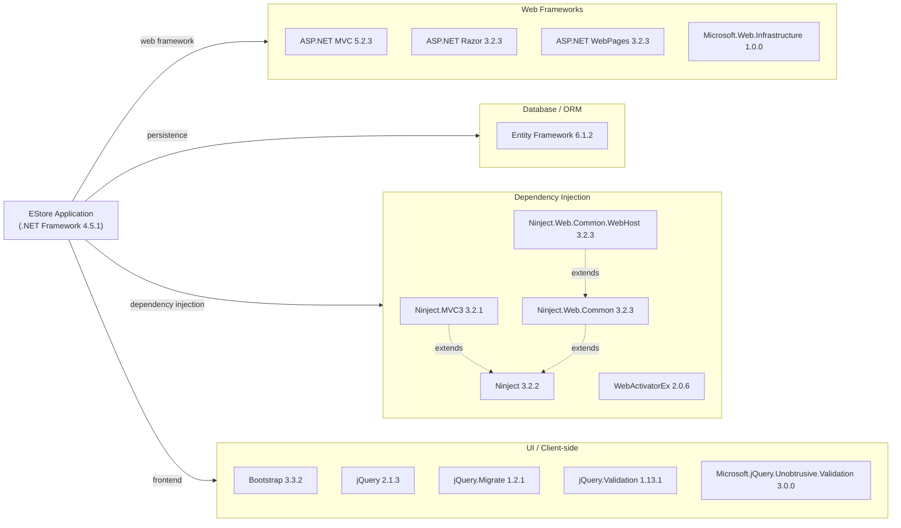

# Dependency Map

This document maps all external dependencies for the EStore ASP.NET MVC 5 e-commerce application (3 projects, 16 unique declared packages across all modules).

## Dependencies

### Dependency Summary

| Category | Count | Key Libraries | Notes |
|----------|-------|--------------|-------|
| Web Frameworks | 4 | ASP.NET MVC 5.2.3, Razor 3.2.3, WebPages 3.2.3 | Legacy MVC stack targeting .NET Framework 4.5.1 |
| Database / ORM | 1 | Entity Framework 6.1.2 | EF6 — legacy ORM with migration path to EF Core |
| Dependency Injection | 5 | Ninject 3.2.2, Ninject.MVC3 3.2.1 | Ninject 3.x is unmaintained; replaced by built-in DI in .NET Core+ |
| UI / Client-side | 5 | Bootstrap 3.3.2, jQuery 2.1.3 | Served as static files; Bootstrap 3 is end-of-life |

### Version & Compatibility Risks

All runtime dependencies are significantly outdated. The application targets **.NET Framework 4.5.1**, which reached end-of-support in January 2016. **ASP.NET MVC 5.2.3** is a legacy framework with no new feature development; the modern equivalent is ASP.NET Core MVC. **Entity Framework 6.1.2** is in maintenance mode and does not support .NET Core natively — migration to EF Core is required for cross-platform compatibility. **Ninject 3.2.2** is effectively abandoned and is not recommended for new .NET projects; built-in `Microsoft.Extensions.DependencyInjection` is the standard alternative. On the client side, **Bootstrap 3.3.2** and **jQuery 2.1.3** are both end-of-life and have known security advisories.

### Notable Observations

- **No logging library declared**: The application relies solely on built-in ASP.NET diagnostics; there is no structured logging framework (e.g., Serilog, NLog) configured.
- **No caching library**: Cache is limited to ASP.NET Session for cart storage; no distributed or output caching is in use.
- **No security/identity library**: Authentication is implemented via legacy `System.Web.Security.FormsAuthentication` (built-in, not a NuGet package) with hardcoded credentials in `Web.config` — a significant security concern.
- **Moq present in EStore.WebUI packages.config**: The mocking library `Moq 4.2` appears in the WebUI project's packages.config in addition to the test project, suggesting it may be a copy-paste artifact or incorrectly scoped.

## Test Dependencies

| Framework | Version | Notes |
|-----------|---------|-------|
| MSTest (via Visual Studio Test Project) | built-in | Default test runner; version tied to VS 2013 project type |
| Moq | 4.2.1502.0911 | Mocking framework for unit test isolation |
| Ninject (test project) | 3.2.2.0 | DI container referenced in test project's NinjectWebCommon |

Total test-scope dependencies: 3

The test project (`EStore.UnitTests`) uses MSTest as the test framework (no explicit NuGet reference — included via the Visual Studio Unit Test project template). `Moq 4.2` provides mocking. Notably, there is no integration test framework or contract-testing library. The version of Moq (4.2, released 2015) is very outdated compared to the current 4.x releases.
