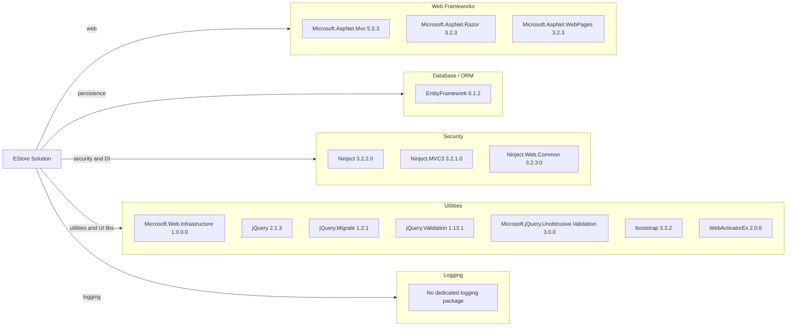

# Dependency Map

This document summarizes declared external dependencies for EStore across its .NET projects (16 primary runtime/build dependencies excluding test-only categorization).

## Dependencies

### Dependency Summary

| Category | Count | Key Libraries | Notes |
|---|---:|---|---|
| Web Frameworks | 3 | Microsoft.AspNet.Mvc, Razor, WebPages | Legacy ASP.NET MVC 5 stack |
| Database / ORM | 1 | EntityFramework 6.1.2 | EF6 on .NET Framework |
| Security | 3 | Ninject, Ninject.MVC3, Ninject.Web.Common | Primarily DI wiring |
| Utilities | 8 | jQuery, Bootstrap, WebActivatorEx | Mix of UI and ASP.NET support packages |
| Logging | 0 | N/A | Uses framework defaults only |

### Version & Compatibility Risks

The solution targets .NET Framework 4.5.1 and uses older packages (for example EF 6.1.2 and ASP.NET MVC 5.2.3), which are maintainable but outdated for modern .NET targets. Migration to net10.0 will require replacing legacy System.Web-based framework dependencies.

### Notable Observations

- Dependency model uses `packages.config` instead of newer PackageReference format.
- No dedicated structured logging library is declared.
- Ninject MVC3 integration is legacy and may need replacement during upgrade.
- Moq is present in both WebUI and UnitTests package lists but treated as test support dependency.

## Test Dependencies

| Framework | Version | Notes |
|---|---|---|
| MSTest (Microsoft.VisualStudio.QualityTools.UnitTestFramework) | Visual Studio test framework | Referenced directly in test project |
| Moq | 4.2.1502.0911 | Mocking library used in unit tests |

Total test-scope dependencies: 2

Test infrastructure exists through MSTest with Moq; it is based on older Visual Studio tooling and may need modernization when upgrading target framework.
